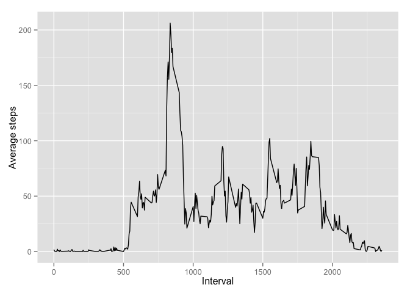
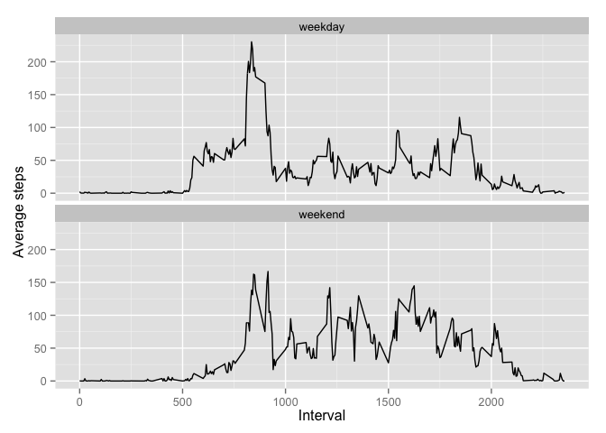

# Reproducible Research: Peer Assessment 1
Iván J. Barrera Olivera  
19 de septiembre de 2015  
This is the first course project for the course of Reproducible Research.
This assignment makes use of data from a personal activity monitoring
device. This device collects data at 5 minute intervals through out the
day. The data consists of two months of data from an anonymous
individual collected during the months of October and November, 2012
and include the number of steps taken in 5 minute intervals each day.

## Used packages
For this assigment we use the following packages:

```r
library(utils)
library(stats)
library(ggplot2)
library(dplyr)
```

```
## 
## Attaching package: 'dplyr'
## 
## The following objects are masked from 'package:stats':
## 
##     filter, lag
## 
## The following objects are masked from 'package:base':
## 
##     intersect, setdiff, setequal, union
```

## Loading and preprocessing the data
In this case, to use de data, first, we have to unzip the file, then read
the `activity.csv` file and convert the date column as POSIX object.

```r
unzip("activity.zip")
activity <- read.csv("activity.csv", header = TRUE)
activity$date <- as.Date(activity$date, "%Y-%m-%d")
```

## What is mean total number of steps taken per day?
Considering that activity data frame have missing values, we need to drop out
thi values using `complete.cases` function.

```r
activity_no_na <- activity[complete.cases(activity),]
```

With this cleaned data set, we can make a histogram of the total number
of steps taken each day, but first we need to aggregate the steps per day.

```r
steps_per_day <- aggregate(x = activity_no_na$steps,
                           by = list(date = activity_no_na$date), FUN = sum)

colnames(steps_per_day)[2] <- "steps"

qplot(steps, data = steps_per_day, geom = "histogram")
```

```
## stat_bin: binwidth defaulted to range/30. Use 'binwidth = x' to adjust this.
```

 

Also, with this data, we can estimate the **mean** an the **median** of the total
number of steps taken per day.

```r
mean(steps_per_day$steps)
```

```
## [1] 10766.19
```

```r
median(steps_per_day$steps)
```

```
## [1] 10765
```


## What is the average daily activity pattern?
With the same data set, we can make a time series plot of the 5-minute
interval (x-axis) and the average number of steps taken, averaged across
all days (y-axis). First, we estimate the average of steps taken across
all days and then we make the plot.

```r
avg_steps_per_interval <- aggregate(activity_no_na$steps,
                                    by = list(interval = activity_no_na$interval),
                                    FUN = mean)

colnames(avg_steps_per_interval)[2] <- "steps"

ggplot(avg_steps_per_interval, aes(interval, steps)) +
        geom_line() +
        xlab("Interval") +
        ylab("Average steps")
```

 

Also, with this data, we can identify the 5-minute interval that contains
the maximum number of steps:

```r
avg_steps_per_interval[with(avg_steps_per_interval, steps == max(avg_steps_per_interval$steps)), ]
```

```
##     interval    steps
## 104      835 206.1698
```

## Imputing missing values
Until now, we have used a dataset that drop out the missing values, but
this could have introduced some bias into our calculations and plots.
So in this section we will impute the missing values.

First, we calculate the total number of missing values in the dataset.


Second, we create a new data set without missing data. For this, we fill
all of the missing values in the dataset, creating a lookup table with the
average steps per interval and using it to fill the missing values with
a for loop structure.

```r
# Creating lookup table
lookup_table <- mutate(avg_steps_per_interval,
                       steps = round(avg_steps_per_interval$steps, digits = 0))

# Creating new dataset
for(i in seq_len(nrow(activity))){
        index <- activity$interval[i] # Selecting the time interval
        if(is.na(activity$steps[i])){
                avg_step <- lookup_table$steps[lookup_table$interval == index] # Identifies the average step for the time interval
                activity$steps[i] <- avg_step # Assign the average step to the missing field
        }
        activity
}
```

Third, we make a histogram of the total number of steps taken each day and,
again, we calculate **mean** and **median** total number of steps taken per day.
We do this to estimate the impact of imputing missing data on the data set over
our previos statistics.

```r
steps_per_day <- aggregate(x = activity$steps,
                           by = list(date = activity$date), FUN = sum)
colnames(steps_per_day)[2] <- "steps"

qplot(steps, data = steps_per_day, geom = "histogram")
```

```
## stat_bin: binwidth defaulted to range/30. Use 'binwidth = x' to adjust this.
```

 

```r
mean(steps_per_day$steps)
```

```
## [1] 10765.64
```

```r
median(steps_per_day$steps)
```

```
## [1] 10762
```

As we can see, in this case, the impact of imputing missing data over our
statistics is really minimal.

## Are there differences in activity patterns between weekdays and weekends?
Finally, to respond this last question, first we create a new factor variable in the
dataset with two levels ("weekday" and "weekend").


```r
# Create a new column to identify the day of the week
activity_w_days <- mutate(activity, weekday = weekdays(activity$date))

# Create a new column for the type of the day (weekday or weekend)
activity_w_days["type_day"] <- NA

# Fill the type of the day column
activity_w_days <- mutate(activity_w_days,type_day = ifelse(activity_w_days$weekday %in% c("Saturday", "Sunday"), "weekend", "weekday"))
```

Then we make a panel plot containing a time series plot of the 5-minute
interval (x-axis) and the average number of steps taken, averaged across
all weekday days or weekend days (y-axis).

```r
# Estimate the average steps taken per weekend
activity_weekend <- activity_w_days[activity_w_days$type_day == "weekend", ]
avg_steps_weekend <- aggregate(activity_weekend$steps,
                               by = list(interval = activity_weekend$interval), FUN = mean)
colnames(avg_steps_weekend)[2] <- "steps"
avg_steps_weekend <- mutate(avg_steps_weekend, type_day = "weekend")

# Estimate the average steps taken per weekday
activity_weekday <- activity_w_days[activity_w_days$type_day == "weekday", ]
avg_steps_weekday <- aggregate(activity_weekday$steps,
                               by = list(interval = activity_weekday$interval), FUN = mean)
colnames(avg_steps_weekday)[2] <- "steps"
avg_steps_weekday <- mutate(avg_steps_weekday, type_day = "weekday")

# Append the two datasets in one
avg_steps_week <- rbind(avg_steps_weekday,avg_steps_weekend)

# Plot the time series
ggplot(avg_steps_week, aes(x = interval, y = steps, group = type_day)) +
        geom_line() +
        xlab("Interval") +
        ylab("Average steps") +
        facet_wrap(~ type_day, nrow = 2, ncol = 1)
```

 

